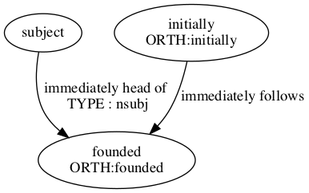
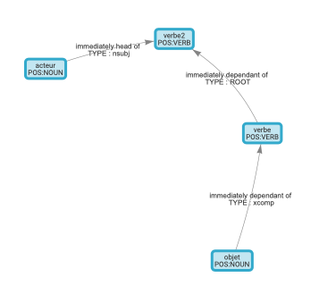

# SDPV : Spacy Dependency Matcher Visualiser

Python module to visualize pattern using Spacy DependencyMatcher format.


## 1. Install


```shell
git clone https://github.com/Jacobe2169/spacy-depmatcher-pattern-visualiser.git
cd spacy-depmatcher-pattern-visualiser
python setup.py install
```

**In addition to the modules listed in `requirements.txt`, GraphViz must be installed!**
## 2. Use

```python
from sdpv import draw_pattern

pattern = [
  # anchor token: founded
  {
    "RIGHT_ID": "founded",
    "RIGHT_ATTRS": {"ORTH": "founded"}
  },
  # founded -> subject
  {
    "LEFT_ID": "founded",
    "REL_OP": ">",
    "RIGHT_ID": "subject",
    "RIGHT_ATTRS": {"DEP": "nsubj"}
  },
  # "founded" follows "initially"
  {
    "LEFT_ID": "founded",
    "REL_OP": ";",
    "RIGHT_ID": "initially",
    "RIGHT_ATTRS": {"ORTH": "initially"}
  }
]
```

### 2.1 Draw using matplotlib

Matplotlib is set by default, so just run:

```python
draw_pattern(pattern)
```

You can customize the node color, the label font color and the size of the generated figure.

```python
draw_pattern(pattern, node_color="grey",node_size=20,figsize=(10,5))
```


### 2.2 Draw using GraphViz

```python
draw_pattern(pattern,mode="graphviz")
```



#### 2.2.1Display in Jupyter Notebook
Compared to Matplotlib, you need to set the parameter `show` to `ipynb`

```python
draw_pattern(pattern,mode="graphviz",show="ipynb")
```

### 2.3 Draw using vis.js (only in Notebook)

```python
draw_pattern(pattern,mode="notebook")
```


### 2.4 Save the Figure

Use the `filename` parameter 
```python
draw_pattern(pattern,mode="graphviz",filename="graphviz.png")
```

**Attention** As of today, the export of vis.js plot is only available in PNG.

## 3. Authors

This module was programmed by Jacques Fize.